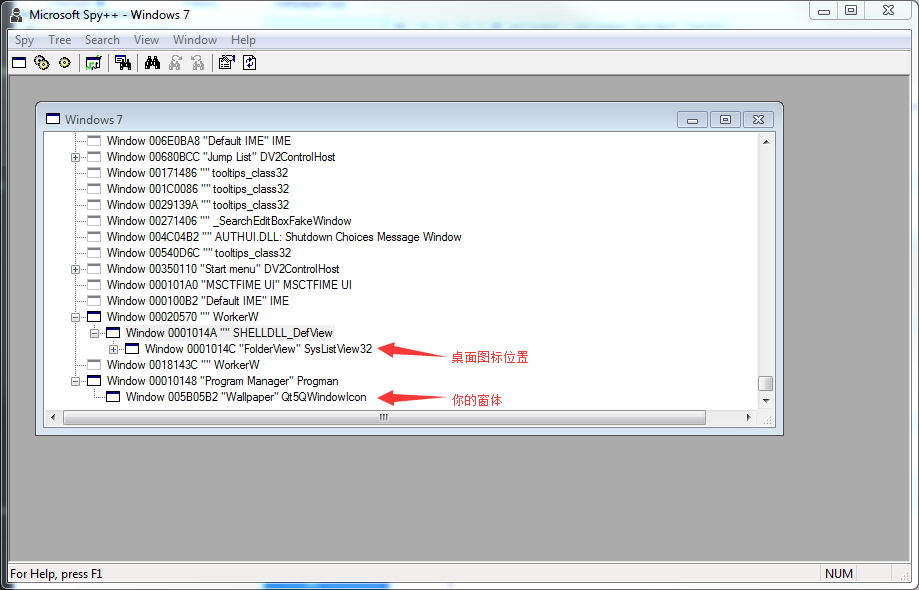
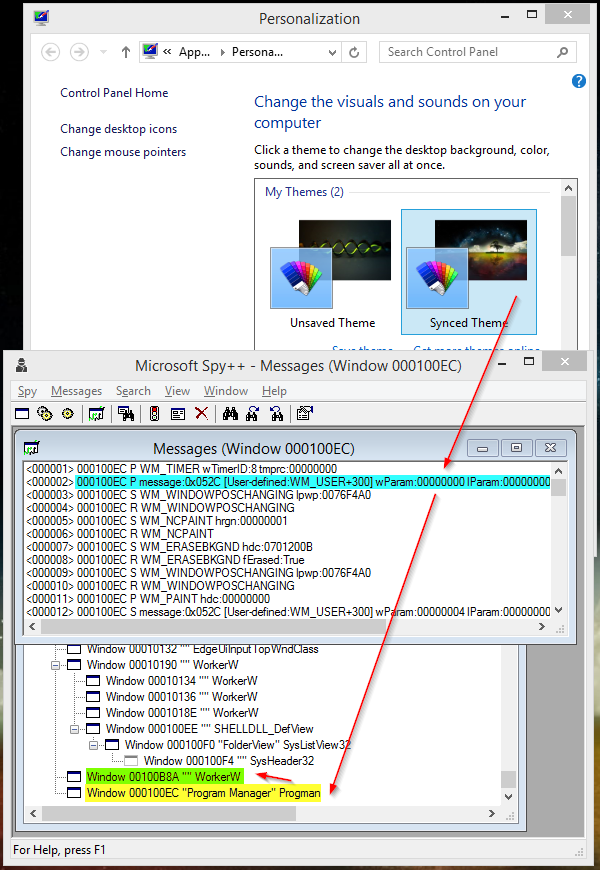
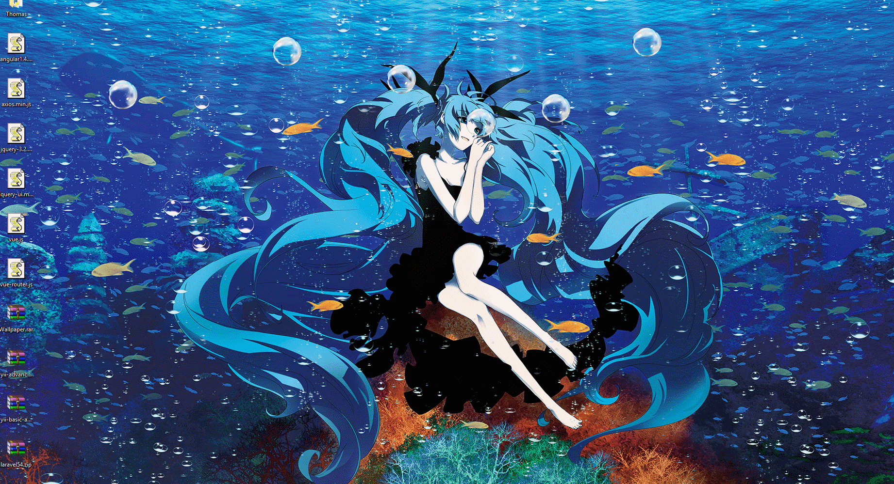

# Wallpaper
把 h5 网页做成 Windows 动态壁纸。Make html5 to windows wallpaper，html、c++ and QT
### 更新
- 2018/8/31 增加 hover 交互的实现

### 文章链接
[使用html5/c++实现windows桌面壁纸](https://zhuanlan.zhihu.com/p/37877070)

### 原理
1. 窗口位置（handle）

2. 发送信息（windows message）

 

 

### 发布版下载（releases）

[https://github.com/ThomasHuai/Wallpaper/releases](https://github.com/ThomasHuai/Wallpaper/releases)

### 演示 （demo）

 

自带粒子效果

 

自带泡泡效果

 

自带涟漪效果

 

three.js demo

 

three.js demo

 

### 设置（config）
- 支持多屏延展
- 本地路径加载页面
- URL加载页面
- 浏览器内核为 chrome，支持 WebGL

### 局限性（limit）
- 不兼容 win8
- 容易造成消息堵塞
- 占用资源较大

### 提供优化方案
如果你有更好的实现方法，欢迎提供至 github/Thomashuai/Wallpaper 
另外，就桌面整理程序的兼容，有一定的问题没有解决，目前没有很好的思路 
如果你能提供更好的方法，也欢迎一起交流学习，非常感谢。 

